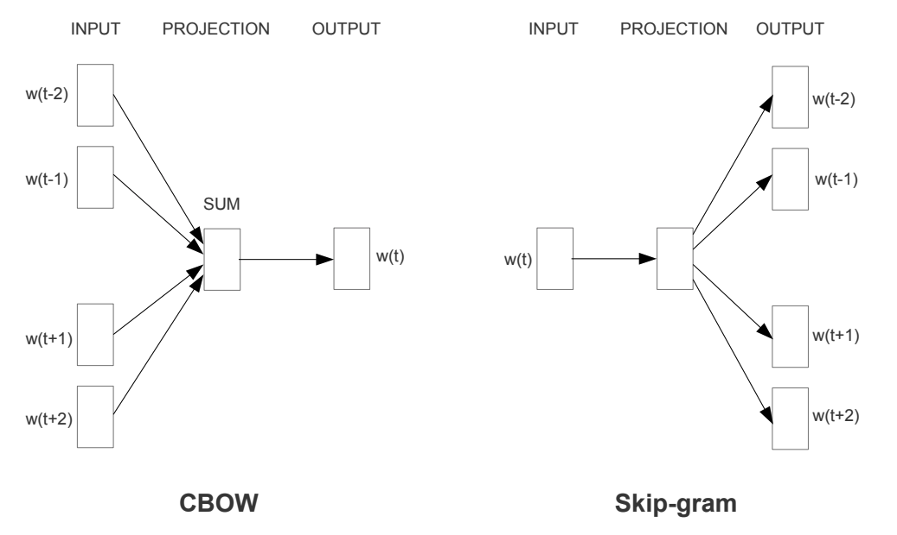
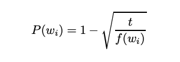
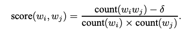

# Word2Vec Implementation with Pytorch

## 0. Develop Environment
- Docker Image : tensorflow/tensorflow:1.13.2-gpu-py3-jupyter
- Pytorch : Stable (1.5) - Linux - Python - CUDA (10.2)
- Using Single GPU (not tested on cpu only)

## 1. Explain about Implementation
- utils.py : Make dataloader, find top 15 nearest word based on euclidean distance or cosine similarity
- model.py : CBOW, Skip-gram model
- train.py : train model
- Sampling strategy on skip-gram is not implemented (give less weight to the distant words by sampling less from those words)

## 2. Brief Summary of *'Efficient Estimation of Word Representations in Vector Space'*
### 2.1 Goal
- Introduce models that can be used for learning high-quality word vectors from huge datasets with billions of words in the vocabulary
- Maximize accuracy of vector operations by developing new model architectures that preserve the linear regularities among words

### 2.2. Intuition
- Most of the complexity is caused by the non-linear hidden layer in the model
- Explore simpler models that might not be able to represent the data as precisely as neural networks, but can possibly be trained on much more data efficiently

### 2.3. New Log-linear Models

#### 2.3.1. Continuous Bag-of-Words Model (CBOW)
- Network : Projection layer + Average projected vectors + Output layer
- Predict current word based on the context
- Best performance by building a log-linear classifier with four future and four history
words at the input

#### 2.3.2. Continuous Skip-gram Model (Skip-gram)
- Network : Projection layer + Output Layer
- Predict surrounding words given the current word
- Select random number R in range < 1 : C > where C is the maximum distance of words and use R words from history and R words for future of the current word as correct labels
- Increasing the range improves quality but it also increases the computational complexity
- Give less weight to the distant words by sampling less from those words since the more distant words are usually less related to the current
- Use C = 10 in paper

### 2.4. Train
- Epoch : 3
- Optimizer : Stochastic Gradient Descent (SGD) + backpropagation
- Learning rate : 0.025 (decrease linearly, so that it approaches zero at the end of the last training epoch)
- Use Huffman tree based hierarchical softmax
- Use cosine distance to find closest vector

## 3. Brief Summary of *'Distributed Representations of Words and Phrases and their Compositionality'*
### 3.1 Goal
- Improve both the quality of the vectors and the training speed of word2vec models
- Overcome inherent limitation of word representations : indifference to word order, inability to represent idiomatic phrases

### 3.2. Intuition
- Good model : able to differentiate data from noise
- Rare words : imbalance between the rare and frequent words
- Phrases : words that appear frequently together, and infrequently in other contexts

### 3.3. Continuous Skip-gram Model (Skip-gram)
#### 3.3.1. Hierarchical Softmax
- Computationally efficient approximation of the full softmax
- Binary tree representation of the output layer

#### 3.3.2. Negative Sampling : Alternative of Hierarchical Softmax
- Distinguish the target word from draws from noise distribution using logistic regression where k negative samples for each data sample
  * Noise distribution : unigram distribution raised to 3/4rd power (heuristic)
  * k = 2 ~ 5 (large datasets) or 5 ~ 20 (small datasets)
- Significant speedup in training + Improve accuracy of the representations of rare words

#### 3.3.3. Subsampling of Frequent Words

- Probability formula of training set is discarded (heuristic)
  * f(w) : frequency of word w
  * t : chosen threshold (around 0.00001)
- Significant speedup in training + Improve accuracy of the representations of rare words

### 3.4. Learning Phrases : Phrase as a single token

- Simple data-driven approach : phrases based on unigram and bigram counts
- Delta : discounting coefficient that prevents too many phrases consisting of very infrequent words to be formed
- Longer phrases : run 2 ~ 4 passes over the training data with decreasing threshold value
- Train
  * Embedding dimension : 300
  * Context size : 5
  * Negative sampling k : 15
- Best model : subsampling + hierarchical softmax

## 4. Reference Paper
- Efficient Estimation of Word Representations in Vector Space [[paper]](https://arxiv.org/pdf/1301.3781.pdf)
- Distributed Representations of Words and Phrases and their Compositionality [[paper]](https://arxiv.org/pdf/1310.4546.pdf)
